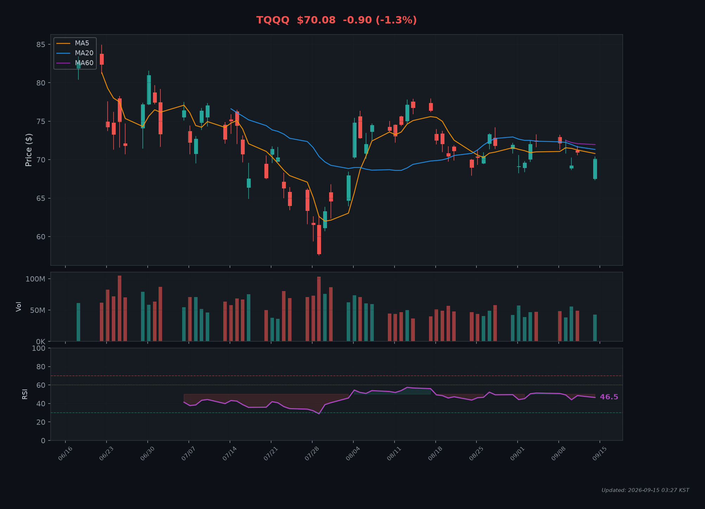
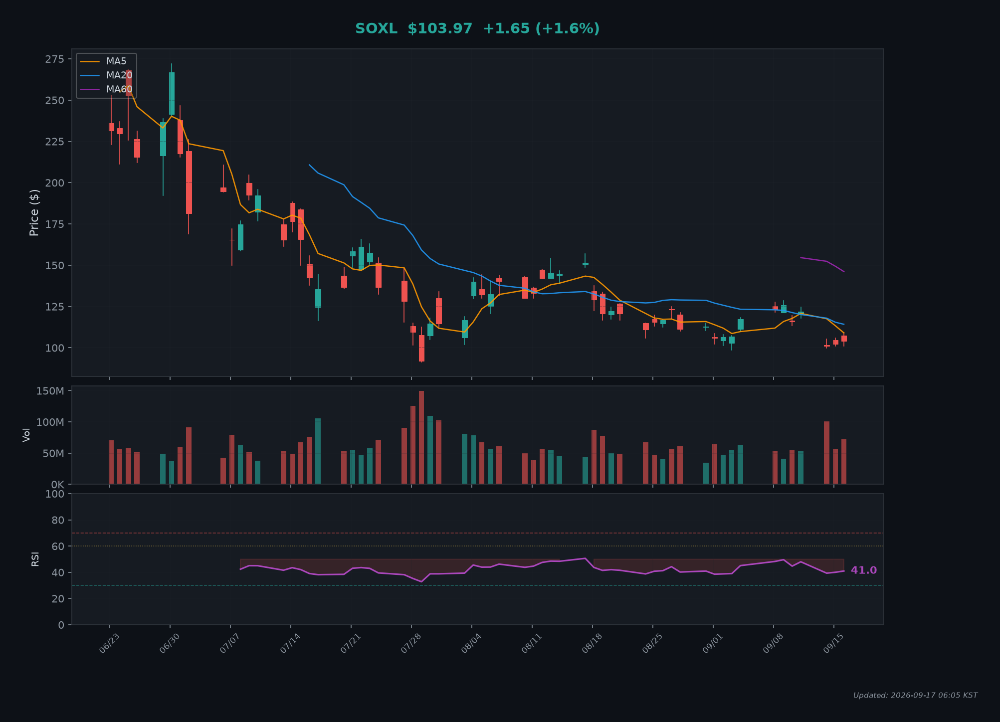

# 📈 무한매수법 V2.2 자동 추천 시스템

👆 **위 뱃지를 클릭**한 뒤 우측 상단의 `Run workflow` 버튼을 누르면 즉시 시세와 차트를 갱신합니다.

> 라오어 무한매수법 V2.2 알고리즘 기반 매일 자동 매수/매도 추천
> 
> ⚠️ **투자 참고용이며, 투자의 책임은 본인에게 있습니다.**

---

## 🟢 시장 상태

| 항목 | 상태 |
|------|------|
| 미국 시장 | 🟢 개장중 |
| 현재 시간 (ET) | 2026-09-25 13:48:21 ET |
| 요일 | 금요일 |
| 마지막 갱신 | 2026-09-26 02:48 KST |

---

## 🎯 오늘의 매수/매도 추천

> 📅 **2026-09-26** 기준 추천 내역

### 💹 TQQQ

**현재가:** $79.7 📈 +1.4% | **RSI:** 63.93 | **거래량:** 45,746,586

#### 📊 시뮬레이션 상태

| 항목 | 값 |
|------|-----|
| 현재 회차 | 0 / 40 |
| 평단가 | $0.00 |
| 보유 수량 | 0.0000주 |
| 총 투자액 | $0.00 |
| 잔여 시드 | $4000.00 |
| 상태 | ⏳ waiting |

**T값 진행:** `[░░░░░░░░░░░░░░░░░░░░]` 0% `T=0`

#### 💡 추천 요약

> 🟡 RSI=63.9 과열 → 진입 대기. RSI 60 미만 시 시작.

#### 🛒 매수 주문

| 방식 | 주문가 | 금액 | 예상 수량 | 비고 |
|------|--------|------|-----------|------|
| ⏸️ 대기 | - | - | - | RSI(63.9) ≥ 60 → 고점 진입 위험. 대기 권장. |

#### 📉 차트

---

### 💹 SOXL

**현재가:** $152.69 📈 +4.3% | **RSI:** 61.63 | **거래량:** 42,198,419

#### 📊 시뮬레이션 상태

| 항목 | 값 |
|------|-----|
| 현재 회차 | 0 / 40 |
| 평단가 | $0.00 |
| 보유 수량 | 0.0000주 |
| 총 투자액 | $0.00 |
| 잔여 시드 | $4000.00 |
| 상태 | ⏳ waiting |

**T값 진행:** `[░░░░░░░░░░░░░░░░░░░░]` 0% `T=0`

#### 💡 추천 요약

> 🟡 RSI=61.6 과열 → 진입 대기. RSI 60 미만 시 시작.

#### 🛒 매수 주문

| 방식 | 주문가 | 금액 | 예상 수량 | 비고 |
|------|--------|------|-----------|------|
| ⏸️ 대기 | - | - | - | RSI(61.6) ≥ 60 → 고점 진입 위험. 대기 권장. |

#### 📉 차트

---

## 📖 무한매수법 V2.2 규칙 요약

📋 클릭하여 규칙 확인

### 매수 규칙
- **원금 40분할**: 총 시드머니를 40회차로 나누어 운용
- **1회차**: 장중 시장가 매수 (RSI < 60 시 진입 권장)
- **2~19회차**: LOC 평단매수(50%) + LOC 큰수매수(50%)
  - 평단매수: 현재 평단가로 LOC 주문
  - 큰수매수: 현재가+10~15% (단, 평단+5% 초과 금지)
- **20~40회차**: 평단가 이하에서만 매수 (큰수매수 중단)

### 매도 규칙
- **1~19회차**: 보유 전량 → 평단가+10% 지정가 매도
- **20~40회차**: 절반 → 평단가+5%, 나머지 → 평단가+10% 분할 매도

### 쿼터 손절
- **40회차 소진 시**: 보유 물량의 1/4 시장가 매도로 시드 재확보

---

🤖 *자동 생성됨 | 2026-09-26 02:48 KST | GitHub Actions*

⚠️ **면책 조항**: 본 시스템은 교육/참고 목적이며, 실제 투자 손익에 대한 책임은 사용자에게 있습니다.
